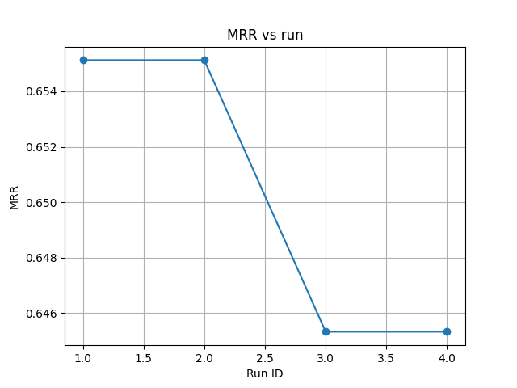
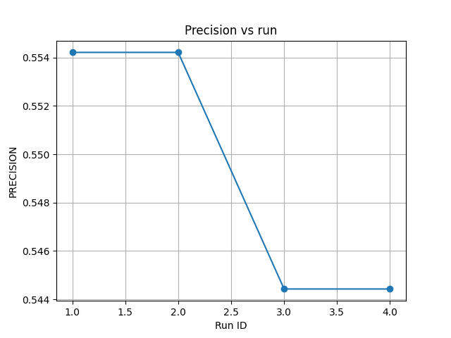

# RAG Training with RapidFireAI on FiQA Dataset

Notebook: Open in Colab

This project builds a Retrieval-Augmented Generation (RAG) system using the FiQA (Financial Question Answering) dataset and evaluates retrieval quality across multiple pipeline configurations with RapidFireAI.

---

## Results

Best Configuration (Variant A): MRR = 0.655

| Chunk | Overlap | top_k | top_n | MRR |
|-------|---------|-------|-------|-----|
| 150 | 20 | 2 | 1 | 0.655 |
| 150 | 20 | 2 | 2 | 0.655 |
| 200 | 60 | 2 | 1 | 0.645 |
| 200 | 60 | 2 | 2 | 0.645 |

---

## Dataset

- Subset of 1,721 documents sampled from FiQA (57k total)
- 664 evaluation queries used due to compute limits
- Metrics: MRR, Precision, Recall, F1, NDCG@5

---

## Model

Qwen2.5-0.5B-Instruct - chosen for speed and Colab compatibility.

---

## Experiment

Parameters varied:

- Chunk size: 150-200
- Overlap: 20-60
- top_k: 1-5
- top_n: 1-2

---

## Takeaways

- Chunk size had the strongest impact on retrieval performance
- Increasing top_n did not improve results on a small dataset
- RapidFireAI enabled fast, parallel evaluation across many configurations

---

## Usage

See the linked Colab notebook for full execution steps.
